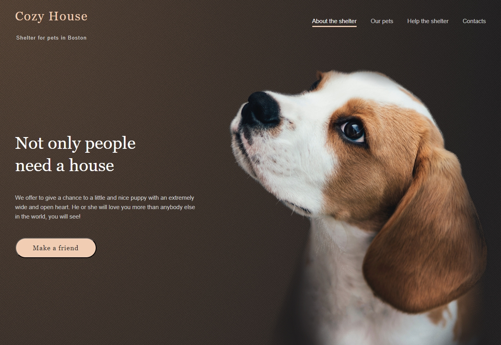

## Shelter-for-pets
___

### 🐶 Ссылка на проект:

* [https://rolling-scopes-school.github.io/andrey-grishkov-JSFE2023Q1/shelter/pages/main/index.html](https://rolling-scopes-school.github.io/andrey-grishkov-JSFE2023Q1/shelter/pages/main/index.html)

___
### ✏️ Описание:

Сайт представляет из себя двухстраничный лендинг приюта домашних животных в Бостоне.


*Главная страница*

Реализована адаптивная верстка Perfect Pixel по макету. Выполнен слайдер, пажинатор,
попап при клике на бургер-меню.
___

### 🗝️ Стек технологий:

*Html, SCSS, BEM, Perfect Pixel, Git, TypeScript, Webpack*


___

### 🐕‍🦺️  Планы по развитию проекта:
* Реализовать back-end часть и перенести в базу данных фотографии
* Сделать верстку адаптивной
* Провести рефакторинг кода по БЭМ и проверить с помощью Prettier
* Добавить Redux
* Добавить анимацию курсора
* Сделать фоновый музыкальный трек лист и добавить кнопки паузы, воспроизведения и т.д.
* Добавить вкладку со списком музыкальных треков
___

### 🐾 Инструкция по запуску на локальной машине:
* Установить [Node.js](https://nodejs.org/ru/)
* Клонировать репозиторий ``` git clone git@github.com:Andrey-Grishkov/postcard-eight-march-for-mom.git```
* Установить зависимости ``` npm install ```
* Запустить приложение ``` npm run start ```
